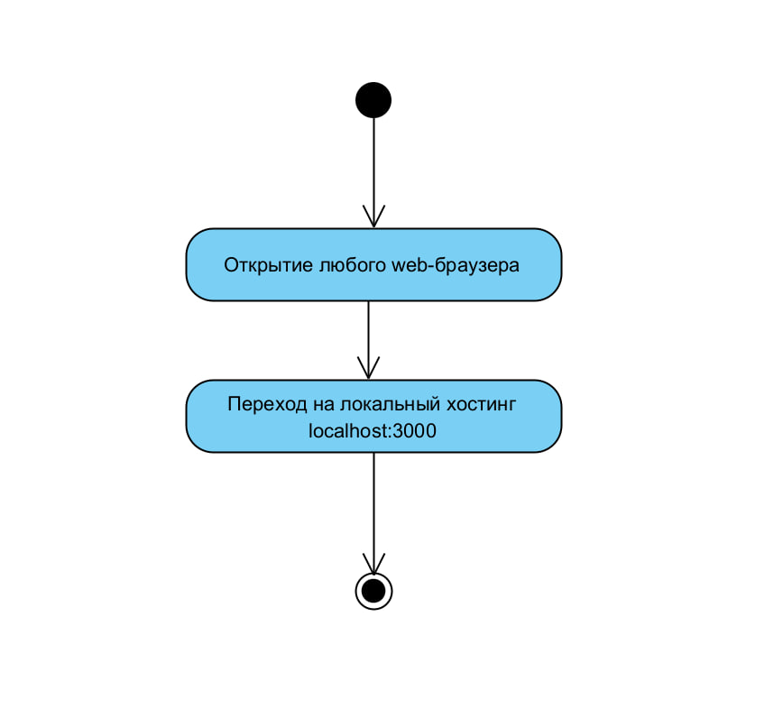

# Диаграммы активностей

# Содержание
1. [Запуск приложения](#1)
2. [Регистрация пользователя в прилложение](#2)
3. [Добавление комнаты по паролю](#3)

### 1. Запуск приложения

### 2. Регистрация пользователя в приложение

### 3. Добавление пользователя в приложение

