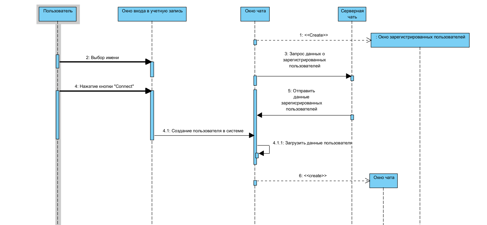
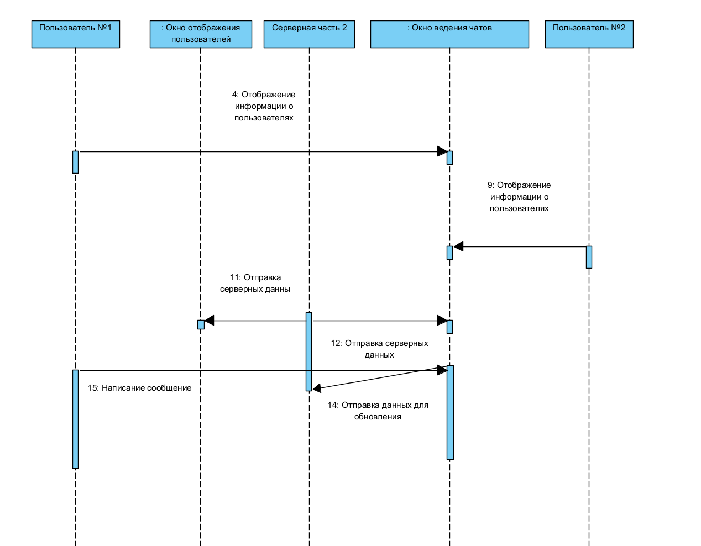
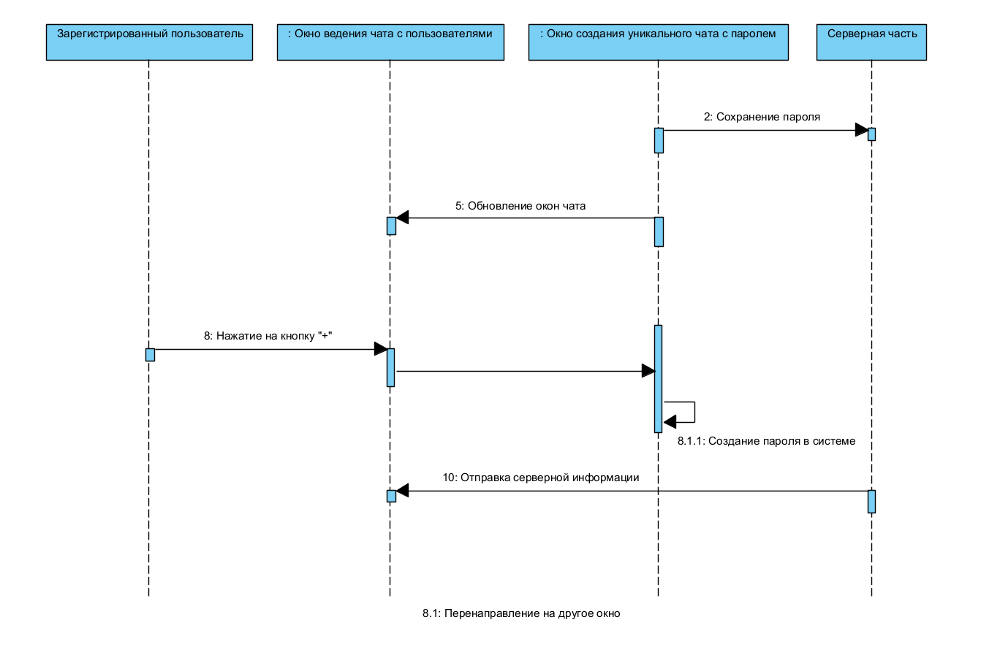

# Диграмма последовательностей

# Содержание 
1. [Создание учетной записи](#1)
2. [Переписка между пользователями](#2)
3. [Добавление комнаты с паролем](#3)

### 1. Создание учетной записи

### 2. Переписка между пользователями

### 3. Добавление комнаты с паролем

