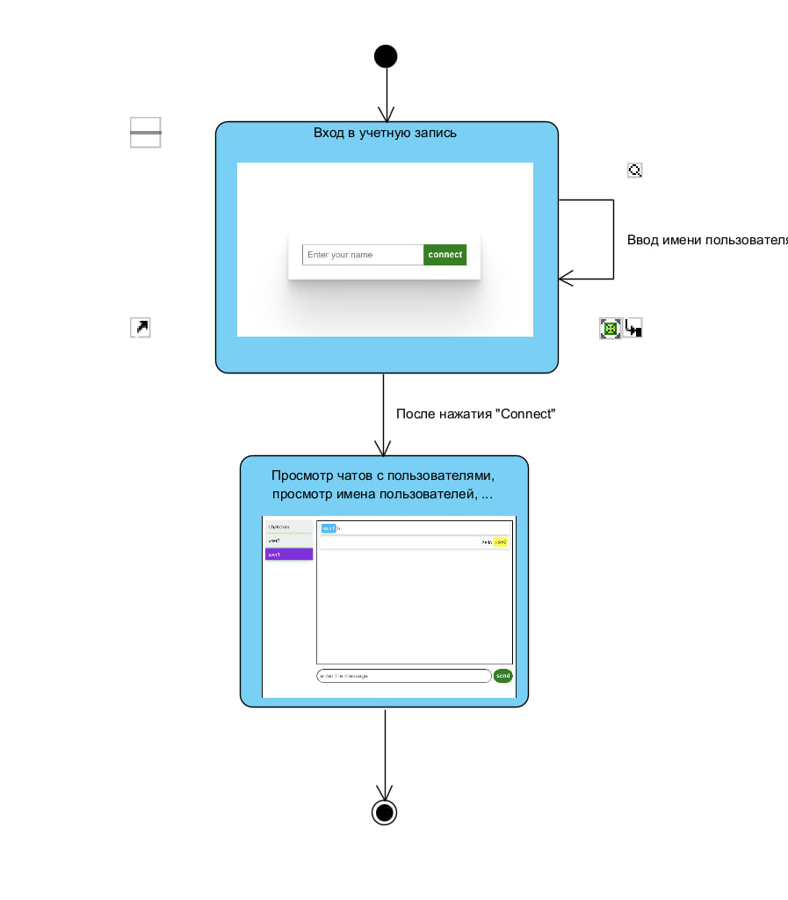
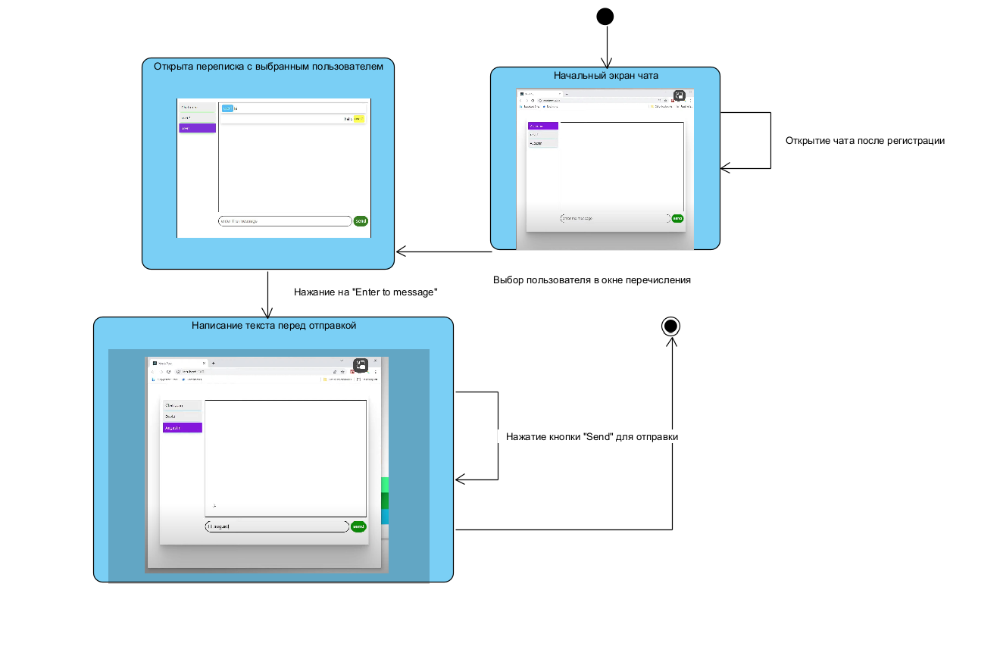

# Диграммы состояний

## Содержание
1. [Регистрация пользователя в чат](#1)
2. [Ведение пользователями переписки](#2)
3. [Создание комнаты с паролем для ограниченного доступа к переписке](#3)

### 1. Вход в учетную запись

### 2. Ведение пользователями переписки

### 3.Создание комнаты с паролем для ограниченного доступа к переписке

